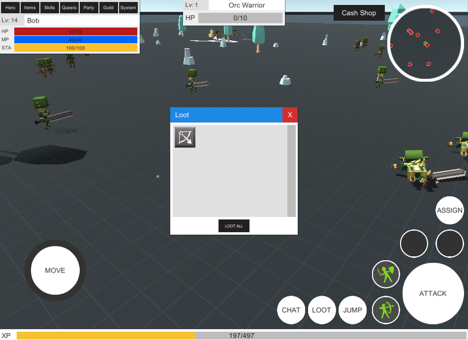
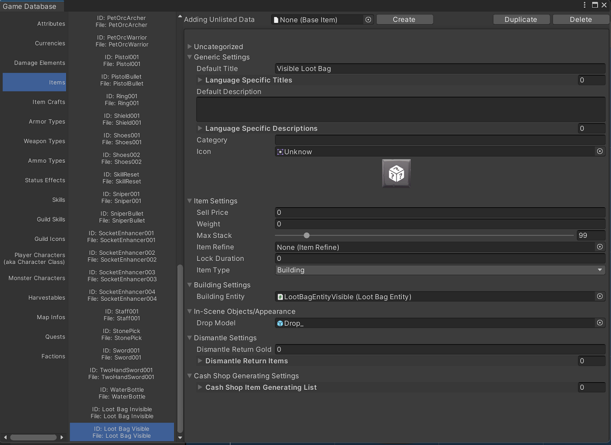
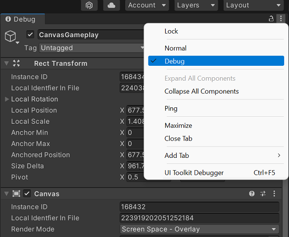
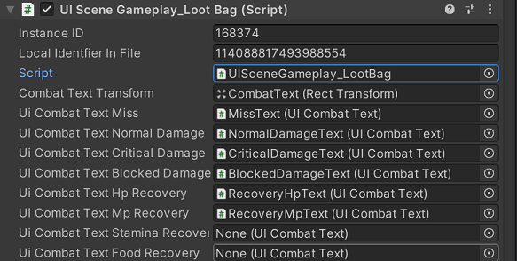
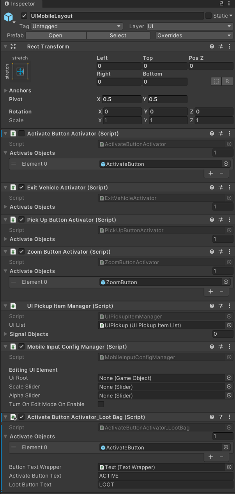
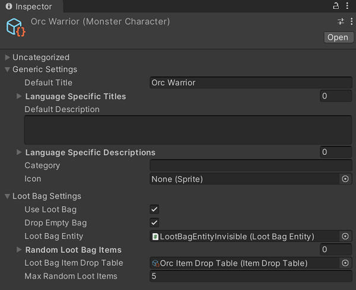
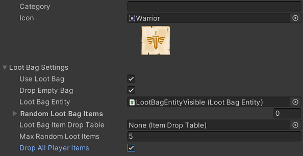

# UnityMultiplayerARPG_LootBag
LootBag add-on for SURIYUN's MMORPG Kit for Unity.

This add-on changes the loot system to drop loot into character loot bags on death, rather than dropping items directly to the ground. 

## Installation instructions
For versions prior to 1.70, refer to instructions here: https://github.com/vaughanb/UnityMultiplayerARPG_LootBag/README-OLD.md

For version 1.70 and later:

Download and import add-on package from: https://github.com/vaughanb/UnityMultiplayerARPG_LootBag/releases

### GameDataBase
Add the provided GameData files for 'Loot Bag Visible' and/or 'Loot Bag Invisible'. This is important or the entities will not be correctly registered for spawning.

### CanvasGameplay Prefab
1. Open CanvasGameplay prefab. If you are using mobile, open CanvasGameplayMobile instead!

2. Add UILootBagStorageDialog prefab from the add-on prefabs directory to UIDialogs_Standalone on CanvasGameplay.

3. Replace UISceneGameplay script on CanvasGameplay with included UISceneGameplay_LootBag script. This can be done by selecting Debug mode at the top-right of the inspector. Then simply drag UISceneGameplay_LootBag.cs onto 'Script' where UISceneGameplay is currently.

4. Open CanvasGameplay in Inspector and add LootBagStorageItemsComponents from the UILootBagStorageDialog to the 'UI Loot Bag Items' field.

5. If you wish to have the loot dialog block the UI, select UILootBagStorageDialog in the dialogs list and add the 'Block UI Controller' component to it.

#### For mobile only: 
6. Expand AttackAndAction on the CanvasGameplayMobile hierarchy and then expand the ActivateButton. Add a TextWrapper component to the Text object on the button.

7. Open UIMobileLayout in the inspector and disable the existing 'Activate Button Activator' component.

8. Add the provided 'Activate Button Activator_LootBag' component to UIMobileLayout and drag the Text object from the ActivateButton into the 'Button Text Wrapper' field.

### Monsters
1. Open any monster character entities you wish to have loot bags in the inspector. Scroll down to 'Monster Character Settings' and increase the 'Destroy Delay' setting to the length of time you wish monster bodies to remain and be lootable before de-spawning (at least 30 seconds recommended).

2. Open the associated MonsterCharacter GameData file for the monster. Under 'Loot Bag Settings', select 'Use Loot Bag' and drag either the provided visible or invisible LootBagEntity prefab onto the 'LootBagEntity' field. 

3. Add any items you wish for the monster to drop under 'Random Loot Bag Items' or add a Item Drop Table file to the 'Loot Bag Item Drop Table' field. Remove loot from the 'Random Items' section under 'Killing Rewards'. This version does not disable the default loot system, so any items in the normal loot section will drop the ground.

4. Open the LootBagEntity selected for the monster above in the inspector. Here you will find a variety of options for the loot bag that you can change to do whatever you want. Make sure to change 'Life Time' under 'Building Settings' to your desired value. If you are using an invisible loot bag entity, it is recommended to use the same time period as the 'Destroy Delay' set on the monster character entity.

### Players
Player characters can also be configured to drop loot on death. To do this:

1. Open the PlayerCharacter GameData file. Under 'Loot Bag Settings'. Under 'Loot Bag Settings', select 'Use Loot Bag' and drag either the provided visible or invisible LootBagEntity prefab onto the 'LootBagEntity' field. For players, it is recommended to use the visible loot bag entity.

2. Under 'Random Loot Bag Items' you can add random loot items the same as for monsters OR select 'Drop All Player Items'.

